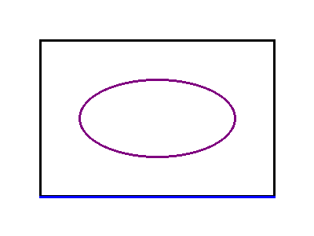

This guide will show you how to host a server and connect to it from a client.

## Running a Cillow server

We'll write minimal code to run a Cillow server with prebuilt patches.

Prebuilt patches include patches to capture real-time streaming outputs that are generated during code execution so it can be redirected to the client. Currently, the following patches are available:

- [`patch_stdout_stderr_write`](../sdk_reference/prebuilt_patches.md#patch_stdout_stderr_write): Captures `sys.stdout` and `sys.stderr` writes.
- [`patch_matplotlib_pyplot_show`](../sdk_reference/prebuilt_patches.md#patch_matplotlib_pyplot_show): Captures `matplotlib.pyplot.show()` calls.
- [`patch_pillow_show`](../sdk_reference/prebuilt_patches.md#patch_pillow_show): Captures `PIL.Image.show()` calls.

> We'll discuss more about writing custom patches in the next section.

```python
import cillow

cillow.add_patches(
    cillow.prebuilt_patches.patch_stdout_stderr_write,
    cillow.prebuilt_patches.patch_matplotlib_pyplot_show,
    cillow.prebuilt_patches.patch_pillow_show,
)

if __name__ == "__main__":
    server = cillow.Server(
        port=5556, max_interpreters=2, interpreters_per_client=1
    )
    server.run()
```

!!! note "Logs"
    ```text
    [Server] Max interpreter processes: 2
    [Server] Interpreter processes per client: 1
    [Server] Number of worker threads: 4
    [Server] Max request queue size: 4
    [Server] Starting worker threads...
    [Server] Listening on tcp://127.0.0.1:5556
    [Server] Press Ctrl+C to exit.
    ```

- `max_interpreters` limits the total number of interpreter processes that can be created.
- `interpreters_per_client` limits the number of interpreter processes that can be created per client.

> Refer [Server component](../sdk_reference/server.md) to know more about all parameters, their default states and how they are calculated.


## Connecting to the server

```python
import cillow

client = cillow.Client.new(host="127.0.0.1", port=5556)

client.run_code("""
from PIL import Image, ImageDraw

img = Image.new('RGB', (400, 300), 'white')

draw = ImageDraw.Draw(img)
draw.rectangle([50, 50, 350, 250], outline='black', width=3)
draw.ellipse([100, 100, 300, 200], outline='purple', width=3)
draw.line([50, 250, 350, 250], fill='blue', width=3)

img.show()
""")
```

!!! success "Output"
    
    ```text
    Execution(result=Result(value=None), streams=[], byte_streams=[ByteStream(type='image', data=b'\x89PNG\r\n...', id=None)], exception=None)
    ```

> Images and plot figures are sent as byte streams, so the client can access them in real-time instead of waiting for the final result. Utilize the `on_stream` callback to access the streams.

By default, the environment is selected as `$system` representing the global Python environment. If you wish to connect with a different environment, you can pass the environment argument.

```python
client = cillow.Client.new(
    host="127.0.0.1", port=5556, environment="/path/to/python/env"
)
```

### Switching environment

> Every new environment starts up in a new interpreter process and has their own namespace.

```python
client.switch_interpreter("/path/to/python/venv")
```

### Deleting environment

```python
client.delete_interpreter("/path/to/python/venv")
```

> After deletion, it will switch to the default environment used while creating the client.

### Installing requirements

By default, `run_code()` method automatically installs the requirements if detected in the code. To install requirements explicitly, use:

```python
client.install_requirements(["package-name"])
```

> If `uv` is installed, it will be used to install the requirements else it will fallback to `pip`.
